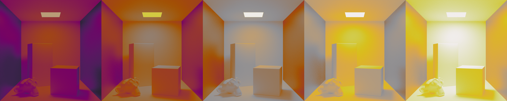
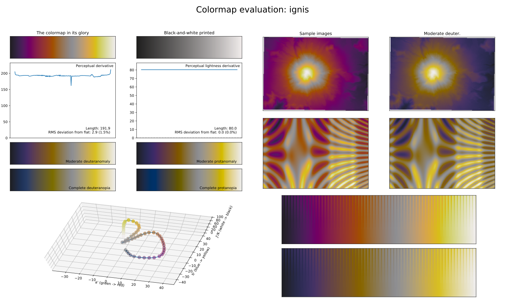
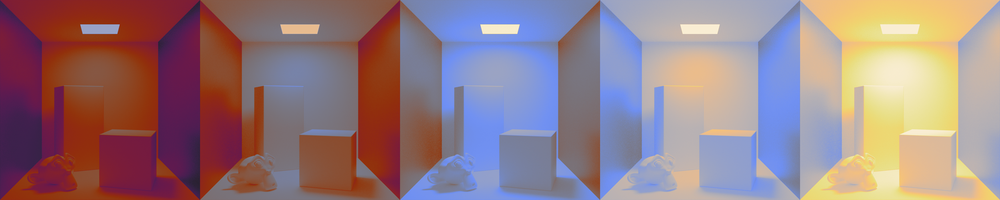
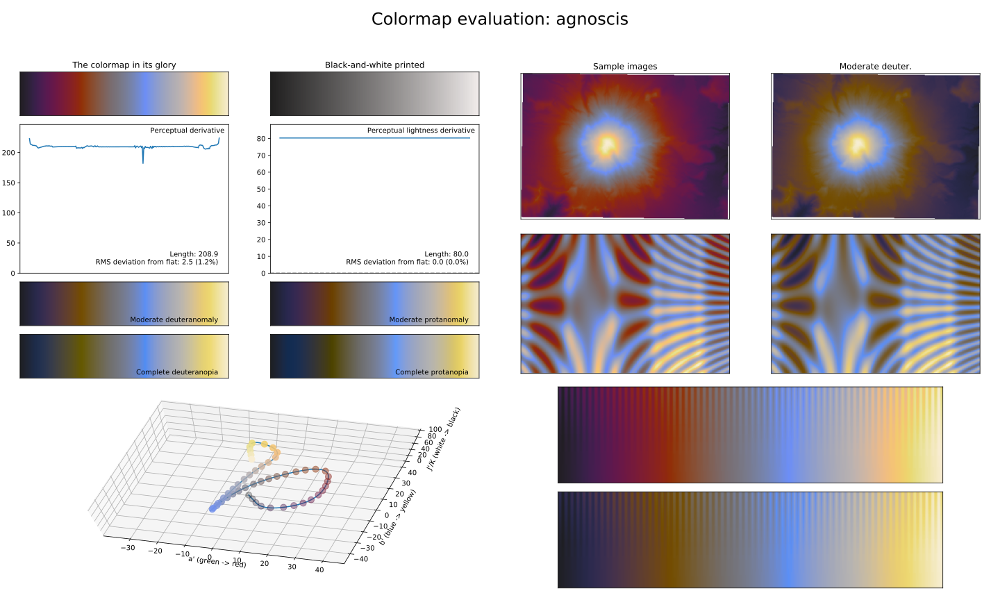
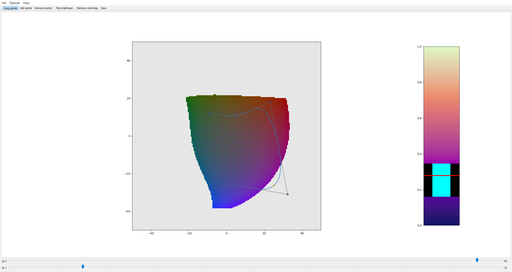
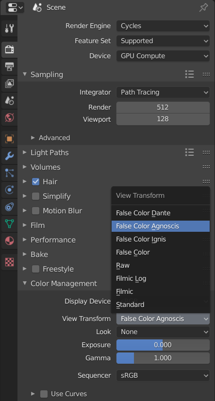

# False color lookup tables for Blender

## Table of Contents

- [Introduction](#introduction)
- [Examples](#examples)
- [Installation](#installation)
- [Code Structure](#code-structure)
- [Creating Colormaps](#creating-colormaps)
- [Generating Lookup Tables](#generating-lookup-tables)
- [Customizing Blender](#customizing-blender)


## Introduction

Blender's "False Color" view transform uses colors which can be difficult to identify for people with color vision deficiency. However, it is possible to integrate customized view transforms into Blender, since its color management is based on OpenColorIO (OCIO). 
A false color view transform can be defined through a lookup table that is stored in an OCIO compatible format. This repository contains a command line interface (CLI) tool that creates lookup tables in the spi3d format from a given colormap. As shown in the 
["Examples"](#examples) section, it comes with a set of premade colormaps that are suitable for people with protanopia, deuteranopia, tritanopia and achromatopsia. Additionally, you can build your own colormaps through a simple syntax that maps exposure values to colors. 
Perceptually uniform colormaps created with [viscm](#create-colormaps-with-viscm) can also be used for the lookup table generation. Please note that the CLI tool generates the lookup tables specifically for Blender and therefore makes the assumption that the scene linear values are first transformed 
with the *Filmic Log* view transform, before the lookup table is applied. 

The content of the following sections is organized to resemble the typical workflow with the CLI tool. Instructions for the installation are provided in the ["Installation"](#installation) section. An overview of the CLI tool's code is given in the section ["Code Structure"](#code-structure), 
which is required knowledge for adding customized colormaps to the tool's code. ["Creating Colormaps"](#creating-colormaps) demonstrates two different approach for crafting suitable colormaps. ["Generating Lookup Tables"](#generating-lookup-tables) explains how to use the CLI tool. Finally, 
["Customizing Blender"](#customizing-blender) presents the necessary modifications to add new view transforms into Blender.

If you're only interested in using the pre-made lookup tables that are shown in the ["Examples"](#examples) section, please skip ahead to ["Downloading pre-made lookup tables and OCIO configuration"](#optional-downloading-pre-made-lookup-tables-and-ocio-configuration).

## Examples
The following lookup tables can be created from the colormaps shipped with the CLI tool or downloaded from the [release page](../../releases).

### Test Scene

The render below is a test scene that will be used to showcase the appearance of the applied false color view transforms. It has been created with Blender's view transform set to *Filmic* and the display transform to *sRGB*.


### False Color Ignis


*Render with "False Color Ignis" view transform applied*


*The Ignis colormap*

| Exposure Value | Color                                    |
| -------------: | :--------------------------------------: |
| -10.0          |  |
|  -7.5          |  |
|  -5.0          |  |
|  -2.5          |  |
|  -1.0          |  |
|   0.0          |      |
|   1.0          |    |
|   2.5          |    |
|   5.0          |    |
|   6.5          |    |


The lookup table has been generated with the following command:

```
python lut_generator.py -o "/home/luts" colormap -n "ignis.spi3d" --not-centered
```

### False Color Agnoscis


*Render with "False Color Agnoscis" view transform applied*


*The Agnoscis colormap*

| Exposure Value | Color                                          |
| -------------: | :--------------------------------------------: |
| -10.0          |  |
|  -7.5          |  |
|  -5.0          |  |
|  -2.5          |  |
|  -1.0          |  |
|   0.0          |      |
|   1.0          |    |
|   2.5          |    |
|   5.0          |    |
|   6.5          |    |

The lookup table has been generated with the following command:

```
python lut_generator.py -o "/home/luts" colormap -n "agnoscis.spi3d" --not-centered
```

### False Color Dante


*Render with "False Color Dante" view transform applied*

This view transform is based on matplotlib's Inferno colormap. Unlike Agnoscis or Ignis it uses a constant color between exposure values.

| Exposure Value | Color                                             |
| -------------: | :-----------------------------------------------: |
| -10.0 to -9.99 |  |
|  -9.99 to -7.5 |  |
|  -7.5 to -5.0  |   |
|  -5.0 to -2.5  |   |
|  -2.5 to -1.0  |   |
|  -1.0 to -0.1  |   |
|   -0.1 to 0.1  |       |
|   0.1 to 1.0   |        |
|   1.0 to 2.5   |      |
|   2.5 to 5.0   |      |
|   5.0 to 6.49  |     |
|   6.49 to 6.5  |     |

The lookup table has been generated with the following command:

```
python lut_generator.py -o "/home/luts" ev-colormap -n "dante.spi3d" 
```


## Installation

1. The CLI tool requires [Python 3.5 or later](https://www.python.org/downloads/). Please install it, if it's not already present on your system.
2. Download the [latest stable release](../../releases) of the CLI tool.
3. Extract the .zip archive to a location of your choice. Ensure that you have the required permissions to read, write and execute in the directory/folder.

No additional steps are necessary for the installation, since the CLI tool is implemented as Python scripts.

## Code Structure

- [`lut_generator.py`](./lut_generator.py)
	- Provides functionality for generating the spi3d lookup table from a given colormap
	- Implements the command line interface
- [`colors.py`](./colors.py)
	- Provides functionality for calculations with colors
	- Contains the pre-made colormaps
		- `ev_colormaps` is the dictionary for colormaps that consist of a list filled with `ColorPoints`
		- `colormaps` is the dictionary for colormaps that consist of a list filled with 256 red, green and blue triplets.
		- Every colormap variable needs to be included in their respective dictionary, otherwise it can't be used from the CLI
- [`mapping.py`](./mapping.py)
	- Provides functionality for mapping between value ranges
- [`file_io.py`](./file_io.py)
	- Provides functionality for loading and saving files

A detailed documentation of each class and function can be found in the source code.

## Creating Colormaps

There are two ways to add new colormaps. You can either define them as variable in `colors.py` or load colormaps created by [viscm](#create-colormaps-with-viscm).

### Create colormaps in `colors.py`

The `colors.py` can be modified to include additional colormaps, which can then be used in the lookup table generation. There are two types of colormaps:

1. Colormaps defined by exposure value and their corresponding color. These can be found in the [`ev_colormaps`](./colors.py) dictionary.
2. Colormaps with 256 entries of color triples. These can be found in the [`colormaps`](./colors.py) dictionary.

All colors are written in floating point format and need to be within the `[0.0, 1.0]` range. If you want to add your own colormap, you will have to:

1. Create a [list](https://docs.python.org/3/tutorial/introduction.html#lists) that contains the colormap information.
2. Add its unique name and reference to the variable in the [dictionary](https://docs.python.org/3/tutorial/datastructures.html#dictionaries).

Once both of these steps are completed you can reference the new colormap with the `-n` or `--name` argument in the CLI.

Without any visualization or existing colormaps to sample colors from, it's fairly difficult to design a colormap that is suitable for people with color vision deficiency. Therefore this approach should only be used if you already know the specific set of colors 
that you wish to use and you need full control over the exact mapping of exposure values to colors. Otherwise it's recommended to use [viscm](#create-colormaps-with-viscm) to design your colormap.

#### Example

Since `ev_colormaps` give full control over the mapping from exposure value (EV) to a color, they will be used as an example in this section. While `colormaps` can also be extended, these colormaps are better generated programmatically, e.g. through viscm and are
therefore not explained in this section. All colormaps in `ev_colormaps` are a list of `ColorPoint` objects, where the first argument is the exposure value, followed by the color. Since the input to the lookup table is coming from Filmic Log, the minimum exposure 
value is -10.0 and the maximum exposure value is 6.5. Colors are interpolated between the given exposure values. For example the following colormap creates a smooth gradient from black to white.


```
example_1 = [ColorPoint(-10.0, [0.0, 0.0, 0.0]),
             ColorPoint(6.5, [1.0, 1.0, 1.0])]
```

For intervals of constant color between two exposure values, create two consecutive entries for the same exposure value and assign different colors for each interval. The following colormap has two intervals or "blocks" of color, black for EVs in `[-10.0, 0.0)` and white
for EVs in `[0.0, 6.5]`.

```
example_2 = [ColorPoint(-10.0, [0.0, 0.0, 0.0]),
             ColorPoint(0.0, [0.0, 0.0, 0.0]),
             ColorPoint(0.0, [1.0, 1.0, 1.0]),
             ColorPoint(6.5, [1.0, 1.0, 1.0])]
```

The `ColorPoint` object has an optional third argument `replace_with_luminance`. If set to `True`, it will ignore the color value and instead use a grayscale color matching the relative luminance in the generated lookup table. This can be useful for intervals of the
colormap that don't have a significant meaning for the use case, therefore a distinctive color isn't used, however it should still be possible to identify changes in value and the direction of the change. In the following example the range between EV -0.5 and EV +0.5
is using the luminance as color output.

```
example_3 = [ColorPoint(-10.0, [0.0, 0.0, 0.0]),
             ColorPoint(-0.5, [0.4, 0.0, 0.4]),
             ColorPoint(-0.5, [0., 0., 0.], replace_with_luminance=True),
             ColorPoint(0.5, [0., 0., 0.], replace_with_luminance=True),
             ColorPoint(0.5, [0.6, 0.0, 0.6]),
             ColorPoint(6.5, [1.0, 1.0, 1.0])]
```

Adding a colormap to the `ev_colormaps` dictionary is accomplished by giving it a unique name and referencing the variable that holds the colormap.

Before the modification:

```
ev_colormaps = {"dante.spi3d": dante}
```


After the modification:

```
ev_colormaps = {"dante.spi3d": dante,
                "example_1.spi3d": example_1,
                "example_2.spi3d": example_2,
                "example_3.spi3d": example_3}
```


### Create colormaps with viscm

[viscm](https://github.com/matplotlib/viscm) is a tool developed by Nathaniel J. Smith and Stéfan van der Walt for analyzing and creating colormaps in a perceptually uniform colorspace (CIECAM02-UCS). It allows the easy creation of colormaps through a graphical user interface.

#### Installation

1. Open a [terminal/shell/command line](terminal.md) and navigate to a directory/folder where you would like to store the viscm program. Make sure that you have permission to read, write and execute software from that directory/folder.
2. Create a [virtual environment](https://docs.python.org/3/library/venv.html) in the current directory `python -m venv .`
3. Activate the virtual environment. **You will always need to activate the virtual environment before starting viscm.**

   | Platform    | Shell      | Command                 |
   | :---------- | :--------- | :---------------------- |
   | Windows     | cmd        | `.\Script\actvate`      |
   | Windows     | PowerShell | `.\Script\Activate.ps1` |
   | Linux/macOS | bash       | `source ./bin/activate` |

   For additional commands for other shells, please take a look at the [documentation of venv](https://docs.python.org/3/library/venv.html#creating-virtual-environments).

4. Install viscm and required dependencies
   - `pip install viscm`
   - `pip install scipy`
   - `pip install PyQt5`

#### Start viscm

1. Enable the virtual environment as described in step 3 of the ["Installation"](#installation-1) section
2. Run `python -m viscm edit`

#### Creating a colormap


The current appearance of the colormap is shown on the right-hand side. A red bar indicates the hue/saturation slice of the colorspace that is currently displayed in the center of the UI. The two sliders at the bottom labeled "Jp0" and "Jp1" set the maximum and 
minimum lightness, respectively. Colormaps are defined through a set of keypoints, indicated by little x's in the UI, that form a curve in the colorspace. A yellow dot on the curve shows what color value is currently used at the position of the red bar in the colormap. 
Keypoints can be added (<kbd>Shift</kbd>+<kbd>LMB</kbd>), deleted (<kbd>Ctrl</kbd>+<kbd>LMB</kbd>) and dragged around by the mouse. This allows to shape the curve and thereby adjust the appearance of the colormap. During the creation it is necessary to ensure that the 
yellow dot always stays within the defined colorspace, otherwise a gap in the colormap will appear as shown in the image below.



In order to create a colormap that is suitable for most people with color blindness, it's best to avoid colors that consist almost entirely of either red, green or blue.

#### Saving a colormap

The current colormap can be saved through *File > Export .py*. The created file can be loaded by the CLI tool in this repository through the `-p` or `--path` argument for the `viscm` positional argument.

#### Check if suitable for color vision deficiency

1. Enable the virtual environment as described in step 3 of the ["Installation"](#installation-1) section
2. Run `python -m viscm view /path/to/colormap.py` where ` /path/to/colormap.py` is replaced with the actual path to the colormap file that shall be analyzed.

The view includes simulations for protonopia and deuteranopia. For additional simulations of color vision deficiency, you can use online services such as [Coblis](https://www.color-blindness.com/coblis-color-blindness-simulator/).

## Generating Lookup Tables

The `lut_generator.py` contain the CLI implementation, therefore you have to call this script through the Python interpreter. This document assumes that the Python interpreter can be called through `python` on the [terminal/shell/command line](terminal.md). 
If you're using a different alias, please adjust the commands accordingly. A short version of the explanation found below can also be viewed on the command line by using the `-h` or `--help` argument.

In order to use the CLI tool you have to supply arguments after the `python lut_generator.py`. There are three types of arguments that are used by the CLI:

- **Flags**: They turn features on or off, e.g. `-t` or `--test` for printing the colormap content on the console.
- **Regular arguments**: This type of argument expects user data, e.g. `--output /path/to/directory` for settings the output path.
- **Positional arguments**: They enable a group of additional arguments that can be supplied after this argument. They are not prefixed with dashes, e.g. `colormap`. Regular arguments need to be positioned before the positional arguments, if they're not part of the additonal
  group of arguments.

### Arguments

- `-o`, `--output`: Sets the output directory for the generated lookup tables. This argument is required.
- `-t`, `--test`: Print the used colormap to the terminal/command line. This argument is optional.

There are three positional arguments that select what kind of colormap is used as base for the lookup table creation. Each of them comes with a set of additional arguments.

- `viscm`: Use a colormap saved by the [viscm](#create-colormaps-with-viscm) tool as Python script.
- `colormap`: Use a colormap from the `colormaps` dictionary in `colors.py`.
- `ev-colormap`: Use a colormap from the `ev_colormaps` dictionary in `colors.py`.

##### Arguments for `viscm`
- `-p`, `--path`: Path to the viscm generated colormap stored as Python script.
- `-n`, `--name`: The filename that shall be used when saving the lookup table.

##### Arguments for `colormap`
- `-n`, `--name`: The name of the colormap that shall be used from the `colormaps` dictionary in `colors.py`.

##### Arguments for `ev-colormap`
- `-n`, `--name`: The name of the colormap that shall be used from the `ev_colormaps` dictionary in `colors.py`.

##### Arguments for `viscm` and `colormap`

The following arguments are available for both positional arguments `viscm` and `colormap`. They are mutually exclusive, meaning that only one of them can be used at a time.

- `--centered`: This argument shifts the input values, in order to map middle grey to the center of the colormap. The input also has to be scaled after the shift to still fit the output values within the [0.0, 1.0] range. This results in parts of the colormap being unused, since the range from the minimum to EV 0 is larger than the EV 0 to the maximum.
- `--not-centered`: The input range is mapped to the color range without any shifts, using the full range of colors. Middle grey is therefore not mapped to the center of the colormap.
- `--blocks-equidistant`: Create a constant color "block" between each neighboring exposure values. This option samples the colors for the given exposure values from equidistant points on the colormap. The argument for this flag should be a quoted and comma separated list of exposure values, used for the sampling from the colormap, e.g. "-10.0, -9.99, -7.5, -5.0, -2.5, -1.0, -0.1, 0.1, 1.0, 2.5, 5.0, 6.49, 6.50"
- `--blocks-centered`: Create a constant color "block" between each neighboring exposure values. This options shifts the input values, in order to map exposure value 0 (EV 0) to the center of the colormap. The input also has to be scaled, after the shift, to still fit within the [0.0, 1.0] range. This results in parts of the colormap being unused, since the range from the minimum to EV 0 is larger than the EV 0 to the maximum. The argument for this flag should be a quoted and comma separated list of exposure values, used for the sampling from the colormap, e.g. "-10.0, -9.99, -7.5, -5.0, -2.5, -1.0, -0.1, 0.1, 1.0, 2.5, 5.0, 6.49, 6.50"
- `--blocks-stretched`: Create a constant color 'block' between each neighboring exposure values. This options shifts the input values, in order to map exposure value 0 (EV 0) to the center of the colormap. The input also has to be scaled, after the shift, to still fit within the [0.0, 1.0] range. The two halves, from the minimum to EV 0 and EV 0 to the maximum, are scaled independently, in order to map the minimum to 0.0 and the maximum to 1.0. This scaling is non-uniform / stretched. The argument for this flag should be a quoted and comma separated list of exposure values, used for the sampling from the colormap, e.g. "-10.0, -9.99, -7.5, -5.0, -2.5, -1.0, -0.1, 0.1, 1.0, 2.5, 5.0, 6.49, 6.50"

### Examples

This section contains examples that showcase the usage of the CLI. They should provide a helpful basis to construct your own commands.

#### Lookup table with gradient of colors

The following command creates a lookup table in `/home/example_1` based on the `ignis.spi3d` colormap, where each normalized input value is directly mapped to the corresponding color in the colormap, due to the `--not-centered` flag.

```
python lut_generator.py -o "/home/example_1" colormap -n "ignis.spi3d" --not-centered
```

#### Lookup table with intervals of constant colors 

The following command creates a lookup table in `/home/example_2` based on the `inferno.spi3d` colormap. Since the `--blocks-equidistant` argument is used, the colors are sampled from equidistant points on the colormap. Each neighboring pair of exposure values,
that have been supplied as arguments, are mapped to their respective constant color. All input values that are e.g. in the interval of EV `[-5.0, -2.5)` will be mapped to the same color, values in the interval EV `[-2.5, -1.0)` will be mapped to a different constant 
color.

```
python lut_generator.py -o "/home/example_2" colormap -n "inferno.spi3d" --blocks-equidistant "-10.0, -9.99, -7.5, -5.0, -2.5, -1.0, -0.1, 0.1, 1.0, 2.5, 5.0, 6.49, 6.50"
```

#### Lookup table from viscm colormap

The following command creates a lookup table in `/home/example_3`. It loads a colormap created by viscm that is stored in a Python script by using the `viscm` positional argument. The path to the colormap file is supplied with the `-p` argument. A name for the
lookup table is given through the `-n "test.spi3d"` argument. Finally `--not-centered` specifies that the normalized input value is directly mapped to the corresponding color in the colormap.

```
python lut_generator.py -o "/home/example_3" viscm -p /home/example_3/viscm_colormap.py -n "test.spi3d" --not-centered
```

## Customizing Blender

The integration consists of two steps, the lookup table files need to be copied into Blender and the `ocio.config` needs to be adjusted to define new view transforms using the lookup tables.

### (Optional) Downloading pre-made lookup tables and OCIO configuration

In case you want to use the pre-made lookup tables from the ["Example"](#example) section, you can download them and a matching `ocio.config` file from the [release page](../../releases).

### Copying lookup tables into Blender

1. Open the installation directory of Blender and create a directory/folder named `custom` in `[2.8x]\datafiles\colormanagement` (the [2.8x] is a placeholder for your Blender version). 
2. Copy the `.spi3d` lookup table files into the `custom` directory.

### Modifying the OCIO configuration

If you've downloaded the pre-made `ocio.config` file, you will have to:

1. Rename the `ocio.config` in `[2.8x]\datafiles\colormanagement` to `ocio_original.config`. In case you want to restore the original OCIO configuration you can rename it back to `ocio.config`.
2. Copy the downloaded `ocio.config` file into `[2.8x]\datafiles\colormanagement`.

If you've created your own lookup tables, you will have to:

1. Rename the original `ocio.config` in `[2.8x]\datafiles\colormanagement` to `ocio_original.config`. In case you want to restore the original OCIO configuration you can rename it back to `ocio.config`.
2. Create a copy of the original `ocio_original.config` and rename the copy to `ocio.config`.
3. Open `ocio.config` in a text editor.
4. Replace `search_path: "luts:filmic"` with `search_path: "luts:filmic:custom"`. This includes the `custom` directory in OCIO's search path.
5. For each new view transform you have to create an entry beneath the `  sRGB:` display. For example the following creates an entry for a view transform named "False Color Ignis" that has a colorspace definition with the same name.
```
    - !<View> {name: False Color Ignis, colorspace: False Color Ignis}
```
6. The colorspace definition has to be added for each new view transform. Its `name:` should match the one chosen in the previous step and the `src:` of the `<FileTransform>` should point to the correct lookup table file.
```
  - !<ColorSpace>
    name: False Color Ignis
    family: display
    equalitygroup:
    bitdepth: 32f
    description: |
      Ignis false color view transform
    isdata: false
    allocation: lg2
    allocationvars: [-12.473931188, 12.526068812]
    from_reference: !<GroupTransform>
        children:
            - !<ColorSpaceTransform> {src: Linear, dst: Filmic Log}
            - !<FileTransform> {src: ignis.spi3d, interpolation: best}
```

### Using the view transform in Blender
 
 Open the *Render Properties* and navigate to the *Color Management* panel. If the installation of the new view transforms was successful you should see them in the *View Transform* dropdown.


